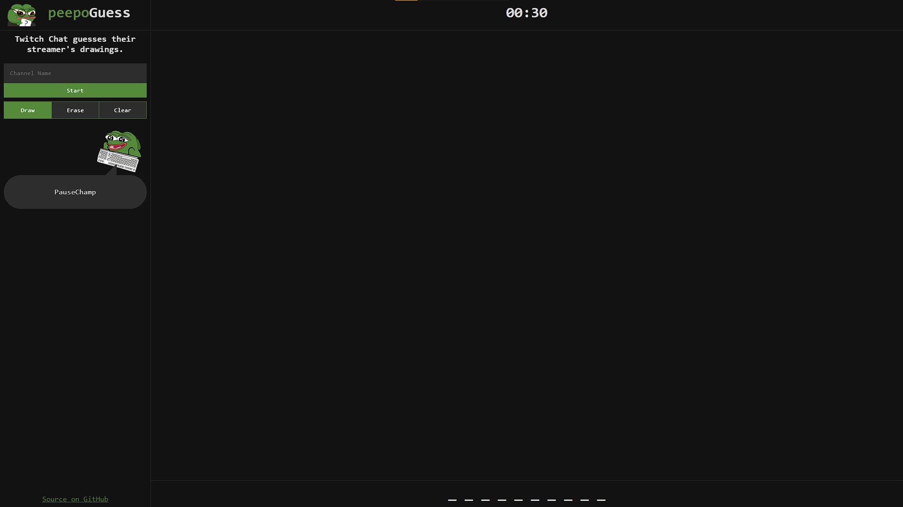

# peepoGuess
A browser game where [Twitch](https://www.twitch.tv/) Chat guesses their streamer's drawings. Hosted on https://peepoguess.app.

## About
The idea for peepoGuess came from watching [xQcOW](https://www.twitch.tv/xqcow) having fun with Google's [Quick, Draw!](https://quickdraw.withgoogle.com/) game. GitHub user [lejara's](https://github.com/lejara/) web application [Da Twitch Charades](https://datwitchcharades.page/) was a great reference due to the number of similar features.

## How to play
Streamers should enter their Twitch channel's name in the input box on the left panel. Clicking start will open a new tab with two buttons and an input box. Clicking the "Reveal word choices" button will reveal two randomly selected words the streamer can choose to draw. The reveal button prevents options from being leaked to chatters. Clicking one of the two options will close the current tab and begin the game. Users have the option of using a custom word by using the input box.

Streamers have 30 seconds to draw the word they chose. In the last 15 seconds, the game starts revealing letters of the chosen word.
